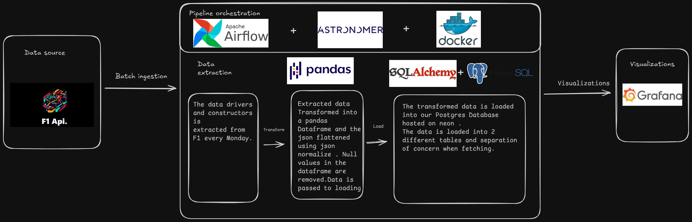

# Formula 1 Championship ETL Pipeline

[](https://www.python.org/)
[](https://airflow.apache.org/)
[](https://neon.tech/)
[](https://grafana.com/)
[](https://opensource.org/licenses/MIT)

> An automated ETL data pipeline that extracts current Formula 1 championship standings, transforms the data, and loads it into PostgreSQL for visualization in Grafana dashboards.

## Overview

This project implements a production-grade ETL pipeline that automatically fetches the latest Formula 1 championship data, processes it, and stores it in a PostgreSQL database. The pipeline runs weekly on Astronomer (managed Airflow) and provides real-time championship standings through Grafana dashboards.

## Medium article

- I have written a medium article where I will document my experince building this project . Check it out in the link below.
- [Medium article for my project](https://medium.com/@maxwelayal9563/formula-one-standings-batch-pipeline-fefc6cc26e67?postPublishedType=initial)

### Key Features

- **Automated Data Extraction**: Fetches current F1 driver and constructor championship standings from F1 API
- **Data Transformation**: Cleans and normalizes data using pandas
- **PostgreSQL Storage**: Stores processed data in Neon PostgreSQL database
- **Grafana Visualization**: Dashboards showing Top 10 drivers (Bar chart), the constructors champinoship(Bar chart) and the drivers point distribution(pie chart)
- **Production Deployment**: Runs on Astronomer Cloud with weekly scheduling
- **Error Handling**: Comprehensive logging and retry mechanisms defined in the DAG
- **XCom Data Passing**: Efficient data flow between Airflow tasks

### Tech Stack

| Technology             | Purpose                               |
| ---------------------- | ------------------------------------- |
| **Apache Airflow 3.1** | Workflow orchestration and scheduling |
| **Python 3.12**        | Data processing and transformation    |
| **Pandas**             | Data manipulation and cleaning        |
| **PostgreSQL (Neon)**  | Data storage                          |
| **SQLAlchemy**         | Database ORM                          |
| **Grafana**            | Data visualization                    |
| **Astronomer**         | Managed Airflow deployment            |
| **F1 API**             | Data source                           |

## Architecture



The pipeline follows a standard ETL pattern:

1. **Extract**: Airflow tasks fetch data from F1 API endpoints (drivers and constructors)
2. **Transform**: Pandas processes and cleans the data, normalizing JSON structures
3. **Load**: SQLAlchemy loads transformed data into PostgreSQL (Neon)
4. **Visualize**: Grafana queries the database to display championship standings

**Data Flow**:

```
F1 API → Airflow DAG → Pandas Transformation → PostgreSQL (Neon) → Grafana Dashboards
```

## Prerequisites

Before setting up this project, ensure you have the following:

### Required Accounts

- **[Astronomer Account](https://www.astronomer.io/)** - For managed Airflow deployment
- **[Neon PostgreSQL](https://neon.tech/)** - Free PostgreSQL database hosting
- **[Grafana Cloud](https://grafana.com/)** (optional) - For cloud-based dashboards, or run locally with Docker

### Required Software

- **Python 3.12+** - [Download](https://www.python.org/downloads/)
- **Docker Desktop** - [Download](https://www.docker.com/products/docker-desktop/)
- **Astronomer CLI** - For local development and deployment
- **Git** - For version control

### Installation Commands

**Install Astronomer CLI** (Windows PowerShell):

```powershell
winget install -e --id Astronomer.Astro
```

**Verify installations**:

```powershell
python --version
docker --version
astro version
```

## Installation & Setup

### 1. Clone the Repository

```bash
git clone https://github.com/ayalasher/F1-batch-pipeline.git
cd F1-batch-pipeline/formulae_1_batch_pipepline
```

### 2. Set Up Astronomer Project

The project is already initialized with Astronomer. To run locally:

```bash
astro dev start
```

This will start:

- Airflow Webserver: http://localhost:8080
- Postgres: localhost:5432

### 3. Configure Airflow Variables

You need to set up the following Airflow Variables (either in Astronomer UI or via CLI):

**For Astronomer Deployment**:

```bash
astro deployment variable create --deployment-id <YOUR_DEPLOYMENT_ID> --key API_URL_DRIVERS --value "https://f1api.dev/api/current/drivers-championship"
astro deployment variable create --deployment-id <YOUR_DEPLOYMENT_ID> --key API_URL_CONSTRUCTORS --value "https://f1api.dev/api/current/constructors-championship"
astro deployment variable create --deployment-id <YOUR_DEPLOYMENT_ID> --key POSTGRES_USER --value "<YOUR_NEON_USER>"
astro deployment variable create --deployment-id <YOUR_DEPLOYMENT_ID> --key POSTGRES_PASSWORD --value "<YOUR_NEON_PASSWORD>"
astro deployment variable create --deployment-id <YOUR_DEPLOYMENT_ID> --key POSTGRES_HOST --value "<YOUR_NEON_HOST>"
astro deployment variable create --deployment-id <YOUR_DEPLOYMENT_ID> --key POSTGRES_PORT --value "5432"
astro deployment variable create --deployment-id <YOUR_DEPLOYMENT_ID> --key POSTGRES_DB --value "<YOUR_NEON_DB>"
```

**For Local Development** (via Airflow UI):

1. Navigate to http://localhost:8080
2. Go to Admin → Variables
3. Add the same variables as above

### 4. Set Up Neon PostgreSQL

1. Create a free account at [Neon.tech](https://neon.tech/)
2. Create a new project
3. Copy your connection details (host, user, password, database)
4. Use these details in Step 3 above

### 5. Deploy to Astronomer (Production)

```bash
astro deploy
```

Select your deployment when prompted.

## Project Structure

```
F1-batch-pipeline/
├── README.md
├── media/
│   └── architecture-diagram.png
└── formulae_1_batch_pipepline/
    ├── Dockerfile                    # Astronomer runtime configuration
    ├── packages.txt                  # System-level packages
    ├── requirements.txt              # Python dependencies
    ├── airflow_settings.yaml         # Airflow configuration
    ├── dags/
    │   ├── etl_batch.py             # Main ETL pipeline DAG
    │   └── exampledag.py            # Example DAG from Astronomer
    ├── src/
    │   ├── drivers/
    │   │   └── drivers.py           # Driver data extraction & transformation
    │   ├── constructors/
    │   │   └── constructors.py      # Constructor data extraction & transformation
    │   └── formula_one_sql.sql      # SQL queries for data verification
    ├── include/                      # Additional Python modules
    ├── plugins/                      # Custom Airflow plugins
    └── tests/
        └── dags/
            └── test_dag_example.py  # DAG testing
```

### Key Files

| File                               | Description                                                      |
| ---------------------------------- | ---------------------------------------------------------------- |
| `dags/etl_batch.py`                | Main Airflow DAG with TaskFlow API implementation                |
| `src/drivers/drivers.py`           | Functions to extract and transform driver championship data      |
| `src/constructors/constructors.py` | Functions to extract and transform constructor championship data |
| `requirements.txt`                 | Python dependencies (pandas, sqlalchemy, psycopg2-binary, etc.)  |
| `airflow_settings.yaml`            | Airflow connections and variables configuration                  |

## Usage

### Running the Pipeline Locally

1. **Start Airflow**:

   ```bash
   astro dev start
   ```

2. **Access Airflow UI**:

   - Open http://localhost:8080
   - Default credentials: `admin` / `admin`

3. **Trigger the DAG**:

   - Find `f1_etl_pipeline_rewrite` in the DAGs list
   - Toggle it to "On"
   - Click the play button to trigger manually

4. **Monitor Execution**:
   - Click on the DAG name
   - View task logs and execution status
   - Check XCom values for data passing between tasks

### Pipeline Workflow

The DAG executes the following tasks in parallel streams:

**Driver Pipeline**:

1. `extract_drivers` - Fetch driver championship data from F1 API
2. `transform_drivers` - Clean and normalize the data
3. `load_drivers_to_database` - Insert into PostgreSQL `drivers_championship` table

**Constructor Pipeline**:

1. `extract_constructors` - Fetch constructor championship data from F1 API
2. `transform_constructors` - Clean and normalize the data
3. `load_constructors_to_database` - Insert into PostgreSQL `constructors_championship` table

Both pipelines run independently and in parallel for optimal performance.

### Viewing Data in Grafana

1. **Set up Grafana Data Source**:

   - Add PostgreSQL data source
   - Use your Neon connection details
   - Test the connection

2. **Import Dashboards**:

   - Create visualizations for:
     - Driver Championship Standings (bar chart)
     - Constructor Championship Standings (bar chart)
     - Points Distribution (pie chart)
     - Top 10 Drivers/Teams (table)

3. **Example Queries**:

**Driver Standings**:

```sql
SELECT
    position,
    driver_name || ' ' || driver_surname AS driver,
    points
FROM drivers_championship
ORDER BY position
LIMIT 10;
```

**Constructor Standings**:

```sql
SELECT
    position,
    "team_teamName" as team,
    points,
    wins
FROM constructors_championship
ORDER BY position;
```

## Database Schema

### Tables

**`drivers_championship`**
| Column | Type | Description |
|--------|------|-------------|
| `position` | INTEGER | Driver's championship position |
| `driver_name` | VARCHAR | Driver's first name |
| `driver_surname` | VARCHAR | Driver's last name |
| `team_teamId` | VARCHAR | Team identifier |
| `points` | FLOAT | Championship points |

**`constructors_championship`**
| Column | Type | Description |
|--------|------|-------------|
| `position` | INTEGER | Team's championship position |
| `teamId` | VARCHAR | Team identifier |
| `team_teamName` | VARCHAR | Team name |
| `points` | FLOAT | Championship points |
| `wins` | INTEGER | Number of race wins |

## Troubleshooting

### Common Issues

**DAG not appearing in Airflow UI**

- Check DAG parse errors in the UI
- Verify all imports are inside `@task` functions
- Ensure DAG parsing time is under 30 seconds

**Environment variables not found**

- Use `Variable.get()` from `airflow.models` instead of `os.getenv()`
- Verify variables are set in Astronomer deployment or local Airflow UI
- Check variable names match exactly (case-sensitive)

**Database connection errors**

- Verify Neon PostgreSQL credentials in Airflow Variables
- Test connection using `psql` or database client
- Ensure Neon project is active (not paused)

**Grafana queries failing**

- Use double quotes for column names with underscores: `"team_teamName"`
- Check actual column names in PostgreSQL using `\d table_name`
- Use `ORDER BY` + `LIMIT` instead of `WHERE` for top N queries

### Debugging Tips

1. **Check Task Logs**: Click on task → View Logs for detailed error messages
2. **XCom Values**: Navigate to Admin → XCom to verify data passing between tasks
3. **Local Testing**: Run `astro dev start` to test DAG locally before deploying
4. **Database Verification**: Query tables directly to confirm data loaded correctly

## License

This project is licensed under the MIT License - see the LICENSE file for details.

## Acknowledgments

- **F1 API** - [f1api.dev](https://f1api.dev) for providing free F1 data
- **Astronomer** - For managed Airflow platform
- **Neon** - For serverless PostgreSQL hosting
- **Apache Airflow Community** - For excellent documentation and support

## Contact

**Project Author**: Ayal ASher  
**GitHub**: [@ayalasher](https://github.com/ayalasher)  
**Repository**: [F1-batch-pipeline](https://github.com/ayalasher/F1-batch-pipeline)

---

⭐ If you found this project helpful, please consider giving it a star!
